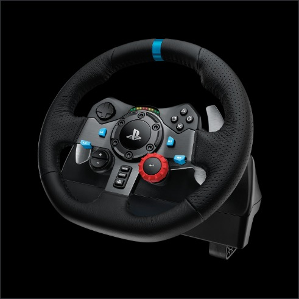

# g29py
> python driver for logitech g29 wheel/pedals



#### install
```bash
pip install g29py
```

```python
from g29py import G29
g29 = G29()
g29.reset() # wheel cal
```

```python
# write 
g29.set_range(500)
g29.set_friction(0.5)
```

```python
#read
g29.start_pumping() # thread
while 1:
    state = g29.get_state()
    print("steering:", state["steering"])
    print("brake:", state["brake"])
    print("accelerator", state["accelerator"])
```

#### sources

- Commands based on nightmode's [logitech-g29](https://github.com/nightmode/logitech-g29) node.js driver.
- Interface uses libhidapi ctype bindings from apmorton's [pyhidapi](https://github.com/apmorton/pyhidapi).


### support

Only Logitech G29 Driving Force Racing Wheels & Pedals kit supported on linux in ps3 mode.

On linux, remove sudo requirements by adding udev rule.

```bash
echo 'KERNEL=="hidraw*", SUBSYSTEM=="hidraw", MODE="0664", GROUP="plugdev"' \
    | sudo tee /etc/udev/rules.d/99-hidraw-permissions.rules
sudo udevadm control --reload-rules
```
